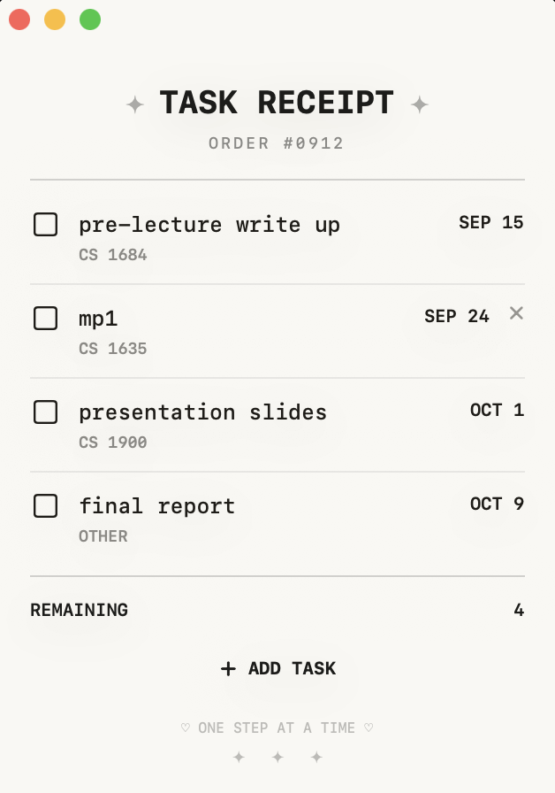

# TaskReceipt

A minimal macOS task manager that turns your to-do list into a receipt.

TaskReceipt is a lightweight desktop app for tracking tasks, courses, categories, and due dates in a simple receipt-inspired interface.

> **Currently available for macOS**

## Features

- Add tasks with a name, course/category, and due date
- Edit existing tasks
- Mark tasks as complete
- Delete tasks
- Automatically sort and display tasks
- Identify overdue tasks
- Automatically resize the receipt as tasks are added or removed
- Save tasks between sessions
- Native macOS interface
- Custom receipt-inspired design

## Preview

<p align="center">
  
</p>

## Using TaskReceipt

Each task contains:

- **Task** — what you need to complete
- **Course / Category** — such as `CS 1635`, `ECON 1110`, `WORK`, or `OTHER`
- **Due Date** — when the task is due

### Add a Task

Click **+ ADD TASK** at the bottom of the receipt.

Enter the task name, course/category, and due date, then click **ADD TASK**.

### Complete a Task

Click the checkbox next to a task to mark it as complete.

### Edit a Task

Click a task to open the edit window.

Update the task information and click **SAVE**.

You can also right-click a task and select **Edit Task**.

### Delete a Task

Hover over a task and click the **×** that appears on the right.

You can also right-click a task and select **Delete Task**.

---

## Installation

TaskReceipt is currently distributed as a macOS Swift application.

> **Note:** TaskReceipt is not currently signed and notarized through the Apple Developer Program. Because of this, macOS may block a prebuilt version downloaded from the internet. The recommended installation method is to build the app locally using the included build script.

### Requirements

You will need:

- macOS
- Xcode Command Line Tools
- Swift
- Git

### 1. Install the Xcode Command Line Tools

Open **Terminal** and run:

```bash
xcode-select --install
```

If they are already installed, macOS will let you know.

You can verify that Swift is available by running:

```bash
swift --version
```

### 2. Download TaskReceipt

Clone the repository:

```bash
git clone https://github.com/britneylu/Receipt-Todo.git
```

Enter the project folder:

```bash
cd Receipt-Todo
```

### 3. Build and Install

Make the included build script executable:

```bash
chmod +x build-app.sh
```

Then run:

```bash
./build-app.sh
```

The script will automatically:

1. Build TaskReceipt
2. Create the macOS application
3. Install `TaskReceipt.app` into your Applications folder
4. Launch TaskReceipt

### 4. Open TaskReceipt

After the initial installation, you can open TaskReceipt like a normal Mac application.

You can find it in:

- **Applications**
- **Spotlight** — press `Command + Space` and search for `TaskReceipt`
- **Launchpad**
- Your **Dock**, if you choose to add it

You do not need to use Terminal every time you want to open the app.

---

## Updating TaskReceipt

If you installed TaskReceipt using the instructions above, open Terminal and navigate to the repository:

```bash
cd Receipt-Todo
```

Download the newest changes:

```bash
git pull
```

Then rebuild the app:

```bash
./build-app.sh
```

The newly built version will replace the previous version in your Applications folder.

---

## Running Without Installing

If you only want to test TaskReceipt without installing the `.app`, you can run it directly from the project directory:

```bash
swift run
```

---

## Development

TaskReceipt is built with:

- **Swift**
- **SwiftUI**
- **AppKit**
- **Swift Package Manager**

The main application source code is located in:

```text
Sources/TaskReceipt/
```

During development, run the project with:

```bash
swift run
```

To create and install the macOS application:

```bash
./build-app.sh
```

## Project Structure

```text
TaskReceipt/
├── Sources/
│   └── TaskReceipt/
│       ├── TaskReceiptApp.swift
│       ├── ContentView.swift
│       ├── TaskRow.swift
│       ├── AddTaskView.swift
│       ├── EditTaskView.swift
│       ├── TodoItem.swift
│       ├── TodoStore.swift
│       ├── AppDelegate.swift
│       └── WindowAccessor.swift
│
├── ReceiptIcon.iconset/
├── ReceiptIcon.icns
├── ReceiptIcon.png
├── taskreceipt.png
├── Package.swift
├── build-app.sh
├── LICENSE
└── README.md
```

## Why TaskReceipt?

TaskReceipt started as a small project to experiment with building a native macOS application using SwiftUI.

The goal was to create a to-do list that feels less like a traditional productivity app and more like a small object that can live on your desktop. The receipt-inspired interface provides a simple way to see what still needs to be completed without unnecessary features or clutter.